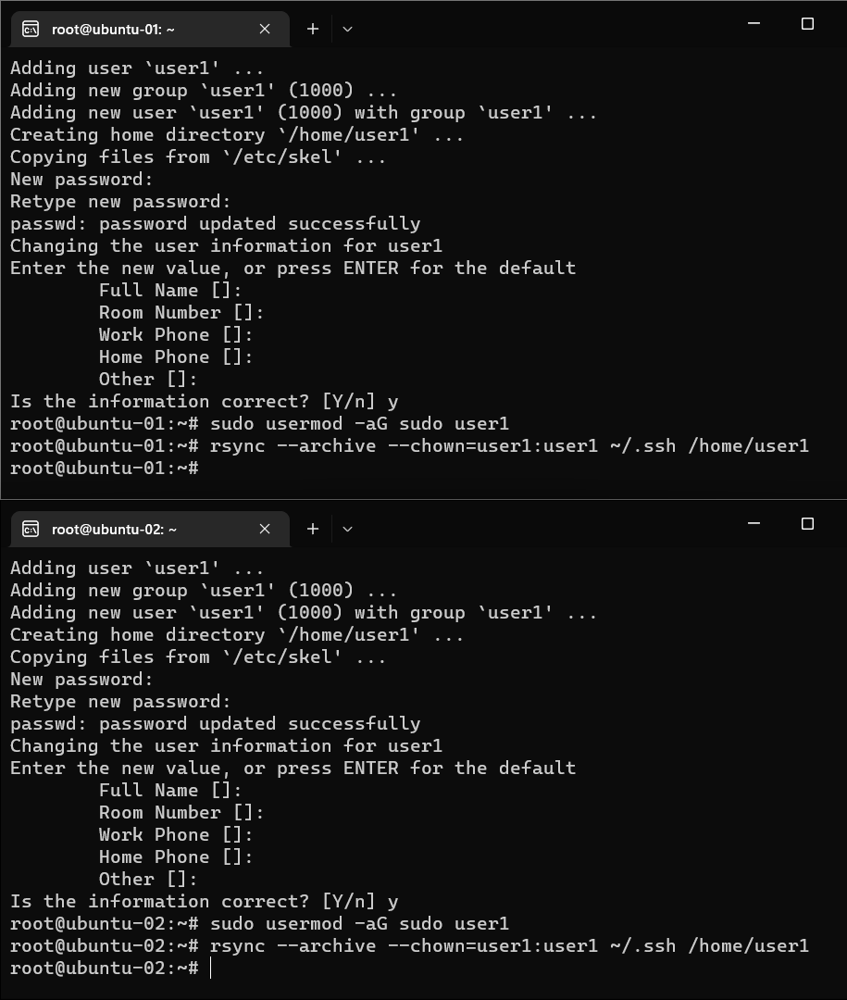
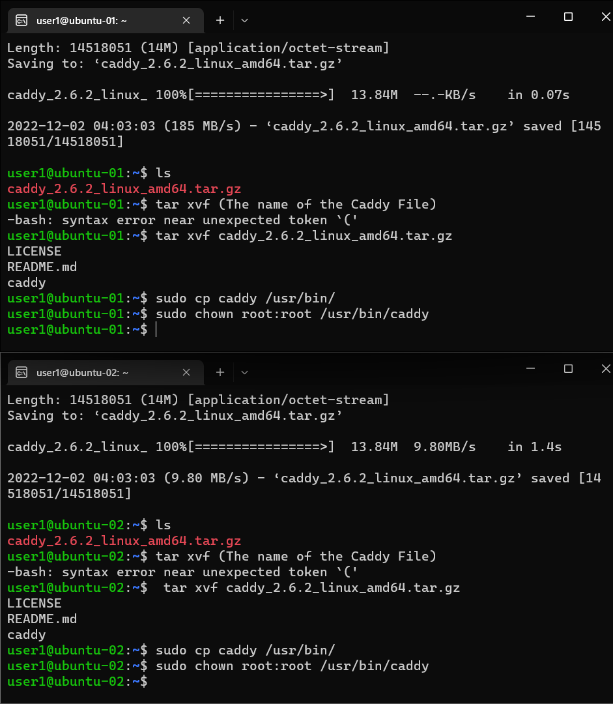
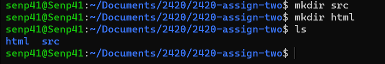
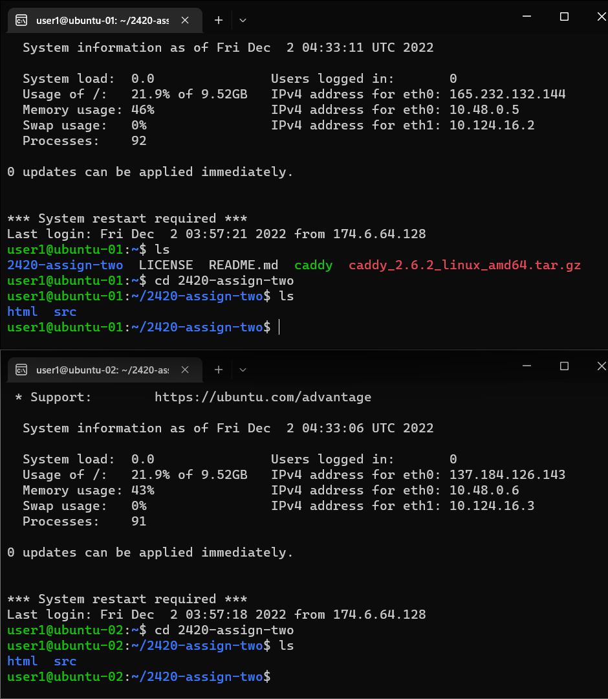

# Week 13 Lab
###### Cloue M.
---
# Setting up
#### Starting off, you need to create the following:
  - Create SSH-keygen
  - VPC
  - 2 Droplets
  - Load Balancer
  - Firewall
  - Adding users for both Droplets
---
## Creating SSH-keygen
  1. Open Windows terminal to generate and ssh key by typing ```ssh-keygen```
  2. It will ask you where you want to store you keygen. For example:
  - ```Enter file in which to save the key (/Users/USER/.ssh/id_rsa): /Users/USER/.ssh/DO2_key```
  - The directory ```/Users/USER/.ssh/DO2_key``` is where the ssh-keygen is stored.
  - Copy the DO2_key.pub: ```cat /Users/USER/.ssh/DO2_key.pub``` then highlight and copy.
  3. Go to you Digital Ocean account and under ```Settings > Security > SSH keys```, click Add ```SSH key```
  4. Paste the DO2_key.pub in SSH key content then name it ```DO2_key``` (or anything you want).
  5. Click ```Add SSH Key```.

---
## Setting up VPC in Digital Ocean
  1. On the left navigation bar, Under ```Manage>Networking>VPC``` click ```'Create VPC Network'```
  2. Change the following settings:
  - Choose a datacenter region:```San Francisco SFO3```
  - Configure the Private IP Range: ```Generate an IP range for me```
  - Choose a name and description: (You can name your VPC anything you want) in this case, let's use ```vpc-web```
  3. Then click ```Create VPC Network```.
---
## Setting up 2 Droplets
  1. On the left navigation bar, Under ```Projects```, select or create a project where you want to store you droplets.
  2. Once your project is created or selected, select ```Resources``` and click ```Get Started with a Droplet``` 
  3. Change the following settings:
  - Choose an image: ```Ubuntu 22.04(LTS) x64```
  - Choose a plan: (you can choose any plan you want) but in this case, let's choose the basic and cheapest ```Basic - Regular with SSD - $4/mo```
  - VPC Network: ```vpc-web``` (or the name of the vpc that you just created)
  - Authentication: SSH keys ```DO2_key``` (or the name of the SSH keygen that you just created)
  - Finalize and Create: 2 Droplets then name it ```ubuntu-1 and ubuntu-2``` for convinience.
  - Add tags: ```Web```
  4. Click ```Create Droplet```
---
## Setting up Load Balancer
  1. Under ```Manage > Networking > Load Balancer```, click ```Create Load Balancer```.
  2. Change the following settings: 
  - Choose a datacenter region: ```San Francisco``` (or where your 2 Droplets that was created is located).
  - VPC Network: ```vpc-web``` (or the name of the vpc that you just created).
  - Connect Droplets: ```Web``` (or the name of the tag you used in the 2 Droplets)
  3. Click ```Create Load Balancer```.
---
## Setting up Firewall
  1. Under ```Manage > Networking > Firewalls```, click ```Create Firewall```.
  2. Change the following settings: 
  - Name: Name it anything you want
  - Inbound Rules: Add a New Rule ```HTTP``` and under Sources: Name of the load balancer that was created.
  - Apply to Droplets: ```Web``` (or the name of the tag you used in the 2 Droplets)
  3. Click ```Create Firewall```
---
## Adding users for ubuntu-1 and ubuntu-2 Droplets
   1. To create a new user ssh to new ubuntu-1 and ubuntu-2 server as root.
   - Use the same username and password for both droplets to make your life easier.
   - ``` ssh -i ~/.ssh/DO2_key root@(server ip address) ```
   - "Are you sure you want to continue" type: ``` yes ```
   - Add user: ```adduser user1```.
   - Enter the same password for both droplet.
   - Add sudo permission to the user: ``` usermod -aG sudo user ```
   - ``` rsync --archive --chown=user:user ~/.ssh /home/user ```
   
   ---
   2. Disabling Root Login
   - ssh to the user that you have created: ```ssh -i ~/.ssh/DO2_key user@(server ip address)```
   - ``` sudo vi /etc/ssh/sshd_config ```
   - Change configuration "PermitRootLogin" from "yes" to "no".
   ---
   3. Updating and Upgrading
   - Update:``` sudo apt update ```
   - Upgrade:``` sudo apt upgrade ```
   ---
   #### Restart SSH
   - ``` sudo systemctl restart ssh ```
   
   #### SSH to your server
   -  ``` ssh -i ~/.ssh/server-key user@123.123.12.123 ``` user@(server address)
   
   #### "Now that you're done setting up, you're Ready to Start!"
---
# Caddy
---
## Installing Caddy in you server
1. Copy and paste this to your command line: 
``` wget https://github.com/caddyserver/caddy/releases/download/v2.6.2/caddy_2.6.2_linux_amd64.tar.gz ```
2. To see if you have successfully downloaded the file: ``` ls ```. You should see the caddy tar.gz file.
3. ``` cd ``` to your home directory where Caddy.tar.gz
4. To unarchive the tar.gz: ``` tar xvf (The name of the Caddy File) ```
5. Copy to the caddy file to bin directory: ``` sudo cp caddy /usr/bin/ ```
6. Change the Caddy file's owner: ``` sudo chown root:root /usr/bin/caddy ```

---
# Creating HTML and NODEJS
  1. In you local machine, create "assign-two" or any name you want.
  2. Inside assign-two directory, create html and src directory.
  
  3. Inside html directory, create ```index.html``` with the content:
  ```
    <!DOCTYPE html>
    <html lang="en ">
    <html>
            <head>
                    <meta charset="UTF-8" />
                    <title>ACIT 2420 Assigment 2</title>
            </head>
            <body>
                    <h1>Welcome to Server x</h1>
                    <p>Test Load Balancer and Firewall</p>
            </body>
    </html>
   ```
  4. Inside src directory, Install node project:
   - ```npm init```
   - ```npm i fastify```
  5. Inside src directory, Create ```index.js``` with the content:
  ```
  // Require the framework and instantiate it
  const fastify = require('fastify')({ logger: true })

  // Declare a route
  fastify.get('/api', async (request, reply) => {
          return { hello: 'Server x' }
  })

  // Run the server!
  const start = async () => {
          try {
                  await fastify.listen({ port: 5050, host: '120.0.0.1' })
          } catch (err) {
                  fastify.log.error(err)
                  process.exit(1)
          }
  }
  ```
 4. Test you server locally.
 5. Move your files from local to ubuntu-1 and ubuntu-2 server using sftp:
 - ```cd``` to where the directory ```assign-two``` located.
 -  ```sftp -i ~/.ssh/DO2_key user1@(ubuntu-1 or ubuntu-2 ip address)```
 - ```put -r assign-two```
 - ssh to both droplets ```ssh -i ~/.ssh/DO2_key user1@(ubuntu-1 or ubuntu-2 ip address)```
 - You should have the copy of ```assign-two``` directory in both of your droplet servers.
 
 6. Copy /html/index.html inside ```assign-two``` directory:
 - cd to assign-two directory:```cd assign-two```
 - Make directory /var/www: ```sudo mkdir -p /var/www/(load balancer server ip address)/```
 - Copy the index.html in var/www: ```sudo cp -r html /var/www/(load balancer server ip address)/```
---
## Adding Caddy Configuration File
1. Edit CaddyFile: ``` sudo vim /etc/caddy/Caddyfile ```
2. Caddyfile content: 
    ```
    http://(server load balancer ip address) {
      root * /var/www/(server load balancer ip address)
      file_server
      reverse_proxy /api localhost:5050
    }
    ```
---
## Start/Restart Caddy Service
1. Edit caddy.service file: ``` sudo vim /etc/systemd/system/caddy.service ```
2. Add Caddy.service content: (see Caddyfile)
    ```
    [Unit]
    Description=Serve HTML in /var/www using caddy
    After=network.target

    [Service]
    Type=notify
    ExecStart=/usr/bin/caddy run --config /etc/caddy/Caddyfile
    ExecReload=/usr/bin/caddy reload --config /etc/caddy/Caddyfile
    TimeoutStopSec=5
    KillMode=mixed

    [Install]
    WantedBy=multi-user.target
    ```
3. Reload the service to save: ``` sudo systemctl daemon-reload ```
4. Start Caddy service: ``` sudo systemctl start caddy.service ```
5. To check Caddy service status: ``` sudo systemctl status caddy.service ```
---
#### Intalling Volta
1. Enter these commands:
- ```curl https://get.volta.sh | bash```
- ```source ~/.bashrc```
- ```volta install node```
--- 

## Hello_Web Node Serivice
  1. Create and Edit hello_web.service file: ```sudo vim /etc/systemd/system/caddy.service ```
  2. Add Caddy.service content: (see hello_web.service):
  ```
  [Unit]
  Description=To run the node application so that load balancer can access
  After=network-online.target
  Wants=network-online.target

  [Service]
  ExecStart=/home/user1/.volta/bin/node /home/user1/assign-two/src/index.js
  User=senp41
  Group=senp41
  Restart=always
  RestartSec=10
  TimeoutStopSec=90
  SyslogIdentifier=hello_web

  [Install]
  WantedBy=multi-user.target
  ```
  3. Enable and Start hello_web.service
  - systemctl enable hello_web.service
  - systemctl start hello_web.service
---
To see if this works, exit to your server ssh: ``` exit ```
and visit your load balancer server ip address in the browser.

#### My Result http://24.199.69.230/
